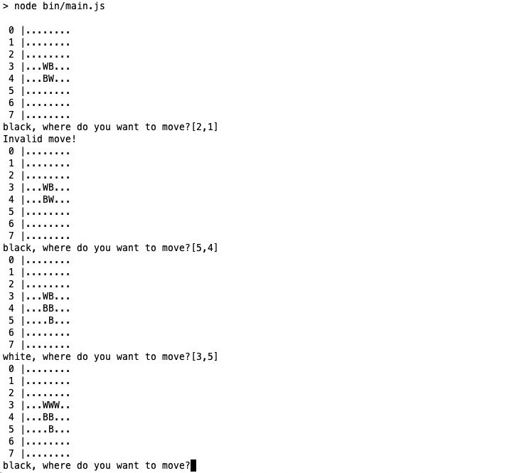

# Reversi in JavaScript

A board game for two players.

## Usage

Before beginning, install dependencies with: `npm install`.

To play the game, run: `npm start`. You position input should be subrrounded by brackets (see sample below).

To run the tests, run: `npm test`.

## Sample

**'W'**: white
**'B'**: black

